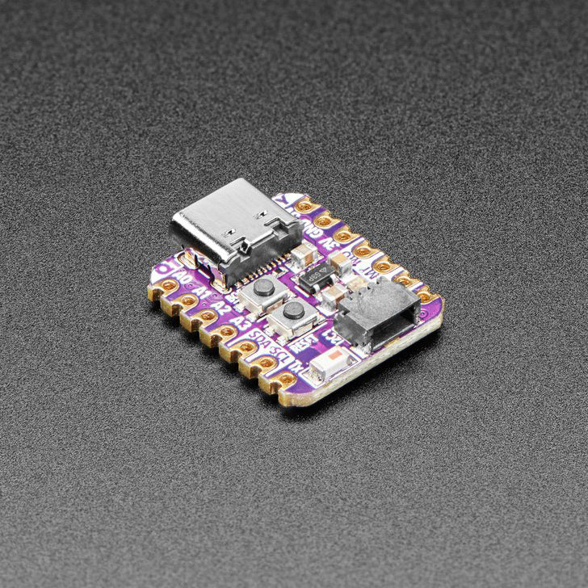
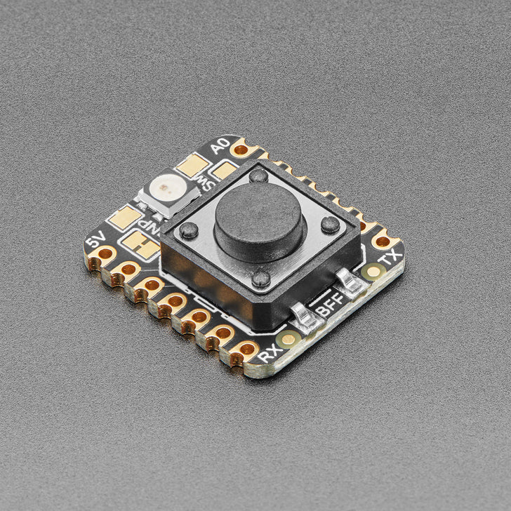

# Simple AWS IoT Application
A simple complete stack IoT application stack with a button and led iot devices. This uses ESP32-S2 boards as the iot thing platform, connecting to AWS using AWS IoT Core. Finally a hosted svelte front-end to access the status of the IoT devices

# Prerequisites
* A stable WiFi connection
* An AWS account
* Basic soldering equipment and knowledge

# Hardware
* For each IoT device (x2):
  * ESP32-S2 Device
    Specifically used the [Adafruit QT Py ESP32-S2 WiFi Dev Board](https://shop.pimoroni.com/products/adafruit-qt-py-esp32-s2-wifi-dev-board-with-stemma-qt?variant=39620155932755)
    
    
  * Adafruit IoT Button with NeoPixel BFF Add-On for QT Py
    Soldered to the ESP32-S2 to add a button and NeoPixel functionality. The Adafruit QT Py ESP32-S2 already has these features but I have found that this add-on is far more user friendly. The LED is a larger diode and the button is far more tactile and fun to press
    
    

# Steps

## Step 1 - preparing the IoT devices

1. Solder the add-on board to the esp32-s2
  Solder the add-On board using the provided header set. The add-on is soldered the the underside of the ESP32-S2. Ensure the add-on board is lined up to the right side in-line with the indicators on it.

  

2. Install the Arduino IDE 2 and setup the IoT devices.
  Follow the [Adafruit QT Py ESP32-S2 guide](https://learn.adafruit.com/adafruit-qt-py-esp32-s2/arduino-ide-setup) to set the board up ready to upload firmware in the next steps. To ensure the add-on board is working you can use the [Adafruit add-on guide](https://learn.adafruit.com/adafruit-iot-button-with-neopixel-bff/arduino) to check. These page guides are saved in PDFs in the [guides](./guides/) folder.

Your IoT devices should now be ready to have our firmware installed onto in further steps 

